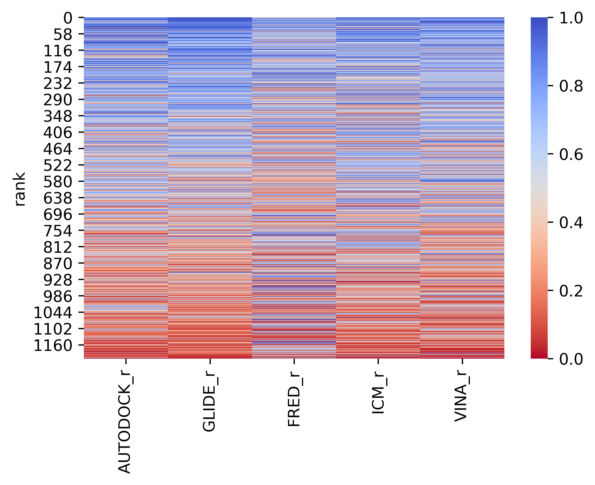

# Automated Pipeline for Consensus Scoring Between Docking Programs

This pipeline facilitates the running of consensus scoring between docking programs. The maximum number of programs supported is five.

## Inputs
1. SDF format file from the docking program. Place this into a directory named after the docking program (one word) within the working directory.
2. All utilities that come with this package.

## Usage
**Example** for consensus of poses scoring (RMSD of 2 Angstroms) for **five** docking programs:

```bash
snakemake --cores 1 --snakefile Snakefile autodock_glide_fred_icm_vina_docking_consensus_plot.png --config number='five'
```
> Where Autodock, Glide, Fred, Icm, and Vina are docking programs.

**Another example** for **three** docking programs:

```bash
snakemake --cores 1 --snakefile Snakefile autodock_glide_fred_docking_consensus_plot.png --config number='three'
```
> Note: Adjust the '--config number' as per your requirement.

## Dependencies

You will need several dependencies to execute this code. The most crucial are:
- Openbabel 2.4.1 and its pybel wrapper

```bash
conda install -c conda-forge/label/cf202003 openbabel=2.4.1
```

### Preliminary Setup

1. Ensure you have **SnakeMake** installed in your conda environment (activate it before installing). Installation instructions for SnakeMake can be found [here](https://snakemake.readthedocs.io/en/stable/getting_started/installation.html).
> Note: Replace 'base' with your conda environment name during the installation process.

2. Modify the `config.yaml` file to contain the score field name in the sdf file with the docked poses and scores.

## Configuration Variables

Some customizable variables include:

- **Consensus Type**: Determines the type of consensus (e.g., two-way, three-way, etc.) especially when using five docking programs. Perhaps you only want a consensus between a minimum number of programs.
    - Adjust by setting the `-cons` flag in the Snakefile to your desired number (maximum is 5).

- **Consensus RMSD**: Defines the agreement between two poses from the corresponding docking programs.
    - Adjust by setting the `-rmsd` flag in the Snakefile to your preferred float value.

By default, the values are set to a three-way consensus and a 2.0 Angstrom RMSD pose agreement.


